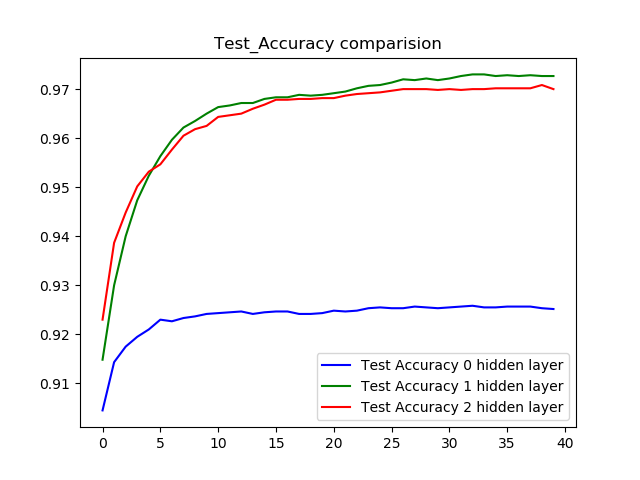
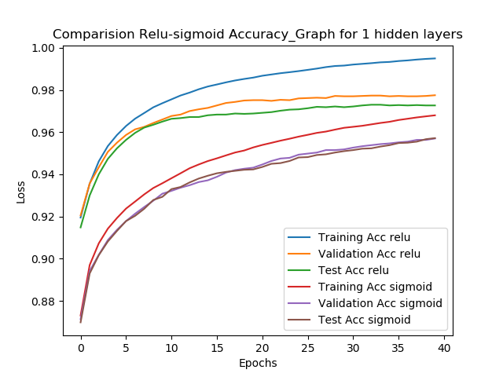
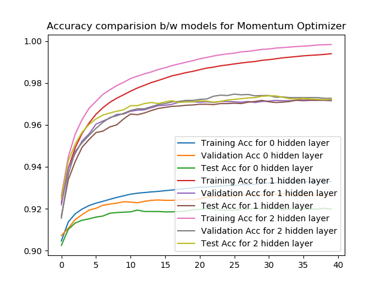
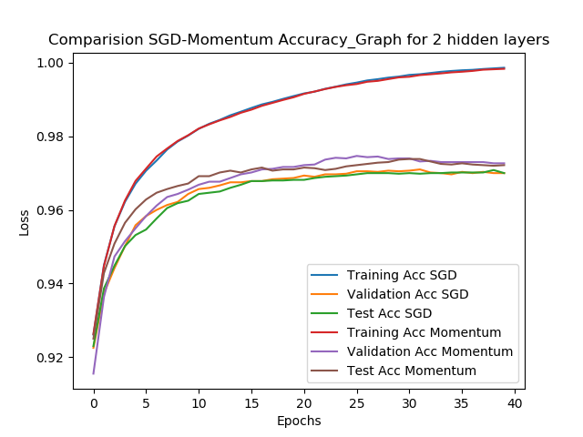
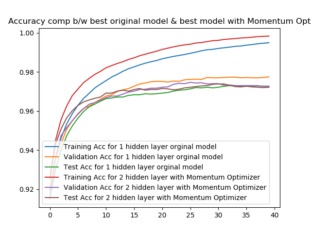

# Neural Network Classifiers in Python from scratch- MNIST-Classification-models

### Introduction
The objective of programming project is to create neural network models for the classification of MNIST image dataset in Python from scratch. (Not using any high-level machine learning library). The task of the project includes designing Fully Connected Neural Network architecture for classification with 0 hidden layers,1 hidden layer, and 2 hidden layers and comparing them based on their performance .i.e. the accuracy of the test dataset and selecting the best performing model.

The motivation behind the project is to learn more about deep learning techniques used for classification.  Neural Networks performs pretty well on data classification tasks especially images. The same technique can also be implemented to other data related to materials science as well. Knowledge of the functioning of the neural networks is pretty general can be implemented in different fields. 

### Architecture of Neural Network models in the Project

In the project work, I have designed the code which can create and train 3 fully connected neural network to classify images in MNIST dataset. (One network can be trained in single run).

  

Image above is an example of Fully Connected Neural Network architecture with two hidden layer. ([Image source link](https://cs231n.github.io/neural-networks-1/))

1. Model with 2 hidden layer contains
    * 784 neurons in input layer.
    * 64 neurons in 1st hidden layer.
    * 64 neurons in 2nd hidden layer.
    * 10 neurons in last layer.

2. Model with 1 hidden layer contains
    * 784 neurons in input layer.
    * 64 neurons in 1st hidden layer.
    * 10 neurons in last layer.

3. Model with 0 hidden layer contains
    * 784 neurons in input layer.
    * 10 neurons in last layer.

Project code allows training and testing of one single model at a time. User can be creative and train its own model on MNIST dataset by using option for other techniques like.

    * Choice for number of layer in neural Network [0 or 1 or 2]
    * Choice for optimizer [SGD or Momentum]
    * Choice for activation function in hidden layers [Relu or sigmoid ]
    * Choice for data normalization algorithm [Simple or Normal]
    * Choice for weights initialization algorithm [Gaussian or Xavier initialization]
    * Choice for implementing L1 regression Loss [y / n]
    * Choice for implementing decaying learning rate [y / n]
    * Choice for number of epochs to train the model.

Project code in the end displays and save the results in form of accuracy history graph per epoch, Loss history graph per epoch and learning rate history graph per epoch and also in form of csv format. Code also saves trained weights and biases in end of training in working directory in csv format.

List of Hyper parameters kept constant in the project are

    * Batch size = 4
    * Learning rate = 0.001
    * Learning rate decay constant= 0.98
    * Momentum parameter = 0.9
    * Regression parameter = 0.00001
    * Neurons in hidden layer = 64

MNIST dataset split used in the project and study in later part is
    
    * Training dataset = 58,000 images
    * Validation dataset = 6000 images
    * Test dataset = 6000 images

### 3. How to use the Code

#### 3.1 Usage Manual for train.py

train.py in a single run
-	Creates the neural network of 2 hidden layers or 1 hidden layer or 0 hidden layer
-	Reads the MNIST data 
-	Initialize the weights and biases for the network
-	Train the network for a given number of epochs.
-	Display the results of accuracy and loss of network in the form of graphs.
-	Save the trained weights, biases, loss history, accuracy history and learning rate history after each run.

The cmd environment used to run train.py file should be installed with the following packages.
    
    1.  Python 3.6 minimum
    2.  Numpy
    3.  Gzip
    4.  matplotlib.pyplot
    5.  tqdm
    6.  CSV

train.py file directory should contain the following MNIST dataset file. Following file act as input to the neural network during the training and testing the network. 

    1.  t10k-images-idx3-ubyte.gz
    2.  t10k-labels-idx1-ubyte.gz
    3.  train-images-idx3-ubyte.gz
    4.  train-labels-idx1-ubyte.gz

If not available then the above-mentioned files can be downloaded from the website [here](http://yann.lecun.com/exdb/mnist/).

##### User input required to run train.py file

There are 8 user inputs required to run the train.py file. The required user input for each case is enlisted below.

**1.	Enter Number of Hidden layers in Model [ 0 or 1 or 2 ]:**

User input can be (0, zero, Zero) for zero hidden layers in a neural network or (1, one, One) for one hidden layer in a neural network with 64 neurons or (2, Two, two) for two hidden layers in a neural network with 64 neurons each.

**2.	Enter the type of normalization for Data [ Simple or Normal ]:**

User input can be (Simple, simple) for simple normalization or (Normal, normal) for normal normalization of Data set.

**3.	Enter function for Weights value initialization [ Gauss or Xavier ]:**

User input can be (Gauss, gauss) for Gaussian initialization or (Xavier, xavier) for the Xavier initialization of weights in the neural network.

**4.	Enter Activation function for hidden layers [ Relu or Sigmoid ]:**

User input can be (Relu, relu) for rectified linear activation function or (Sigmoid, sigmoid) for the sigmoid activation function for the hidden layers.

**5.	Want to implement L1 Regression in the Model [ y / n ]:**

User input can be (Y, y) for implementing L1 regression or (N,n) for not implementing L1 regression during training the model.

**6.	Want to implement the decaying learning rate [ y / n ]:**

User input can be (Y, y) for implementing the decaying learning rate or (N,n) for not implementing the decaying learning rate during training the model.

**7.	Enter type of Optimizer want to use to train the model [SGD or Momentum]:**

User input can be (sgd, SGD) for implementing stochastic gradient descent or (momentum, Momentum) for implementing momentum optimizer during training the model.

**8.	Enter Number of Epochs for training the model:**

User input should be an integer which is equivalent to the number of epochs the user wants to train the selected neural network.

#### 3.2 Usage Manual for predict.py

-	Predict.py file uses the trained weights and biases (which is output on train.py file) to predict the test dataset MNIST images.
-	 In predict.py file, I have used the 1 hidden layer models with trained weights and biases. (I reason for selecting this model for prediction is, this model has better accuracy on MNIST test set than other 0 hidden layer model or 2 hidden layer model. I have shown the study of the performance of models in the later.)
-	 predict.py file read the MNIST test dataset and feed the image array of 6000 length in the model one by one and use the model to predict the label of images.
-	predict.py display predicted images with the predicted label of the image by model and true label of an image on the display image window title.

predict.py file directory should contain the following MNIST dataset file. Following file act as input to the neural network testing of MNIST images

      1.  t10k-images-idx3-ubyte.gz
      2.  t10k-labels-idx1-ubyte.gz
      3.  train.py
      4.  saved files folder (contain .csv for weights and biases)

### Model performance Study based on the result from train.py

I have carries out a comparative analysis on the basis of the accuracy of different models. Training runs are carried out for the model with 0 hidden layers, 1 hidden layer and with 2 hidden layers with different algorithm used to update weights, with different activation functions to find the best fit for the MNIST dataset.
I have created the comparison graphs for accuracy curve for different runs of 3 different layer models. I have divided them into 3 different categories.

1.	Performance comparison of Models with Relu activation functions in the hidden layer with stochastic gradient descent optimizer.(for 3 models)
2.	Performance comparison of Models with Sigmoid  activation function in the hidden layer with stochastic gradient descent optimizer (for 3 models)
3.	Performance comparison of Models with Relu activation function in the hidden layer and with Momentum optimizer (for 3 models)

#### 1.	Performance comparison of Models with ReLu activation functions in the hidden layer with Stochastic Gradient Descent optimizer.(for 3 models)

In this case, models are trained with Stochastic Gradient Decent optimizer and ReLu activation function in their hidden layer. From the graphs below we can observe that the model with 1 hidden layer (64 neurons in the hidden layer) is a better performing model than models with 2 hidden layers (with 64 neurons in each layer) and the model with 0 hidden layers. 

  

#### 2.	Result of Models with Sigmoid activation function in the hidden layer with Stochastic Gradient Descent optimizer.

In this case, models are trained with Stochastic Gradient Decent optimizer and sigmoid activation function in their hidden layer.In the graph below, we see that the model with 1 hidden layer (with 64 neurons) with sigmoid activation function performs better than the model with 2 hidden layers (with 64 neurons in each layer) with sigmoid activation function.

  

And if we compare case 1 with case 2 for model with 1 hidden layer, we can observe that the model with 1 hidden layer (64 neurons) with relu activation function perform better than the model with 1 hidden layer (64 neurons) with sigmoid activation, shown the graph below

  

#### 3.	Models with Relu activation function in the hidden layer and with Momentum optimizer.
In this case, models are trained with Momentum optimizer and ReLu activation function in their hidden layer.

  

In the above accuracy graph we can see the test accuracy curve for 1 hidden layer model and 2 hidden layer model is pretty close. In other graphs below I compare the model with 2 hidden layer for case 1 and case 3 (i.e. with relu activation function SGD vs Momentum) . 

  

And in the graph below we can see with the use of momentum optimizer test accuracy of 2 hidden layer model become comparable to the original 1 hidden layer model (best performing model in above cases) 

  

