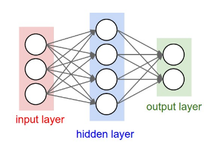

# MNIST-Classification-model

### Introduction
The objective of programming project is to create neural network models for the classification of MNIST image dataset in Python from scratch. (Not using any high-level machine learning library). The task of the project includes designing Fully Connected Neural Network architecture for classification with 0 hidden layers,1 hidden layer, and 2 hidden layers and comparing them based on their performance .i.e. the accuracy of the test dataset and selecting the best performing model.

The motivation behind the project is to learn more about deep learning techniques used for classification.  Neural Networks performs pretty well on data classification tasks especially images. The same technique can also be implemented to other data related to materials science as well. Knowledge of the functioning of the neural networks is pretty general can be implemented in different fields. 

### Architecture of Neural Network models in the Project

In project work, I have designed the code which can create and train 3 fully connected neural network to classify images in MNIST dataset. (One network can be trained in single run).

 
