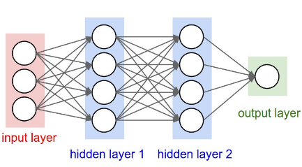

# MNIST-Classification-model

### Introduction
The objective of programming project is to create neural network models for the classification of MNIST image dataset in Python from scratch. (Not using any high-level machine learning library). The task of the project includes designing Fully Connected Neural Network architecture for classification with 0 hidden layers,1 hidden layer, and 2 hidden layers and comparing them based on their performance .i.e. the accuracy of the test dataset and selecting the best performing model.

The motivation behind the project is to learn more about deep learning techniques used for classification.  Neural Networks performs pretty well on data classification tasks especially images. The same technique can also be implemented to other data related to materials science as well. Knowledge of the functioning of the neural networks is pretty general can be implemented in different fields. 

### Architecture of Neural Network models in the Project

In project work, I have designed the code which can create and train 3 fully connected neural network to classify images in MNIST dataset. (One network can be trained in single run).

  

Image above is an example of Fully Connected Neural Network architecture with two hidden layer. Image source (https://cs231n.github.io/neural-networks-1/)

1. Model with 2 hidden layer contains
   * 784 neurons in input layer.
   * 64 neurons in 1st hidden layer.
   * 64 neurons in 2nd hidden layer.
   * 10 neurons in last layer.

2. Model with 1 hidden layer contains
   * 784 neurons in input layer.
   * 64 neurons in 1st hidden layer.
   * 10 neurons in last layer.

3. Model with 0 hidden layer contains
   * 784 neurons in input layer.
   * 10 neurons in last layer.

Project code allows training and testing of one single model at a time. User can be creative and train its own model on MNIST dataset by using option for other techniques like.

    * Choice for number of layer in neural Network [0 or 1 or 2]
    * Choice for optimizer [SGD or Momentum]
    * Choice for activation function inn hidden layers [Relu or sigmoid ]
    * Choice for data normalization algorithm [Simple or Normal]
    * Choice for weights initialization algorithm [Gaussian or Xavier initialization]
    * Choice for implementing L1 regression Loss [y / n]
    * Choice for implementing decaying learning rate [y / n]
    * Choice for number of epochs to train the model.
